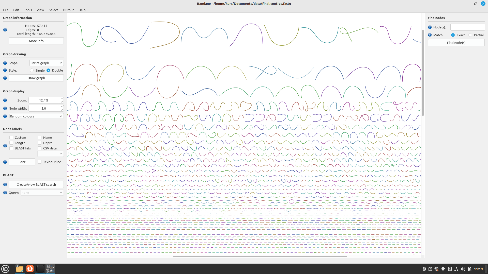
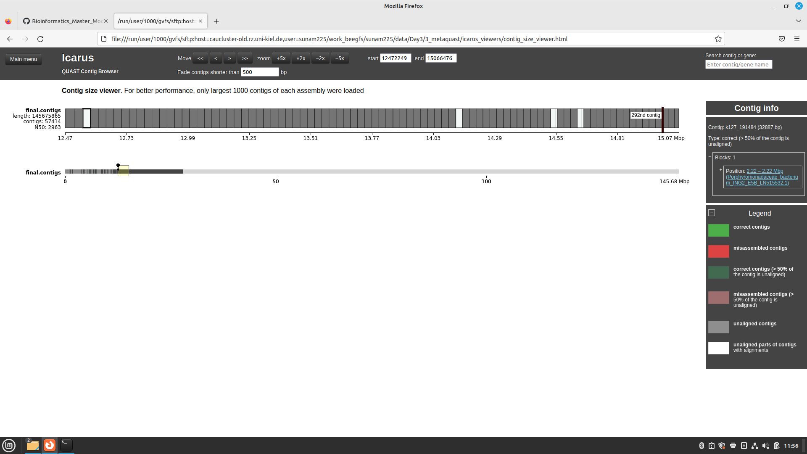

# Day 3 From contigs to MAGs

== We use the data from biogas reactor which were sampled every two-three months during two years. Longitudinal studies do not rely on results from a single sample that might be a nonrepresentative outlier. ==

Sequences composition is used to distinquish different genomes. 

## Basic for binning 

 - process of clustering genomes into OTUs
 - genomic signatures: GC content, k-mer content, coverage of reads (additional: tetranucteotide normalization frequences and other which I didn't get)
 
 ## Coverage data in multiple samples 
 
 - clustering frequences of coverages of contigs give to reconctrustion of genomes - MAGs
 - metrics for completeness of genomes: count single copy genes (SCGs: ribosomal and housekeeping) 
 - metrics of contamination: if there are regions where more than 1 single copy - then it's contamination
 - check for fragmentation

## Assembly Quality assessment via Bandage

## MAGs Quality assessment via QUAST 

|Estimates   |value | description | 
|:-----------|-----|------------:|
|N50 value   |      | | 
|# of contigs|      | | 

# Bandage

