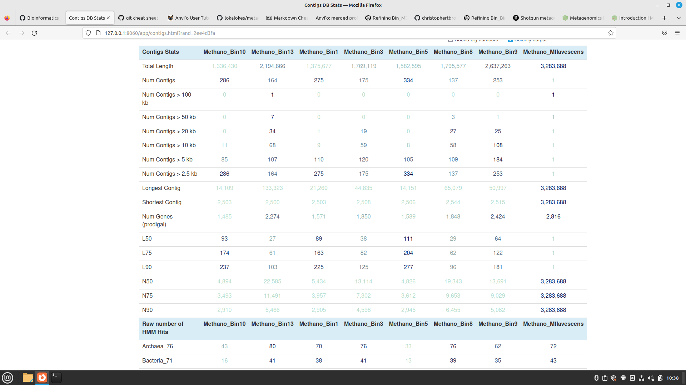
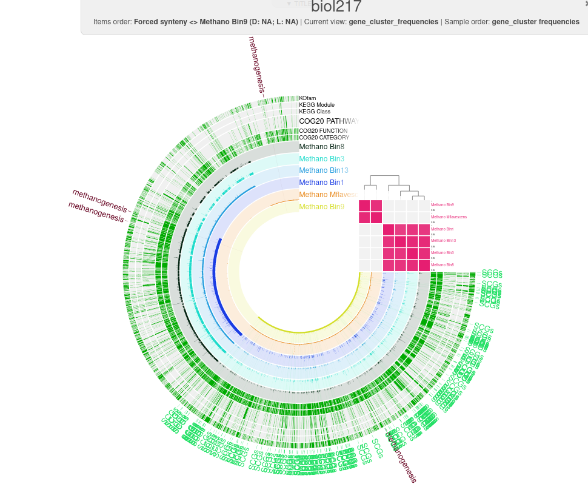
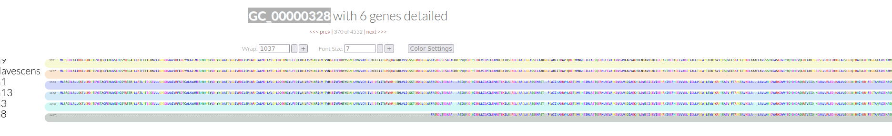
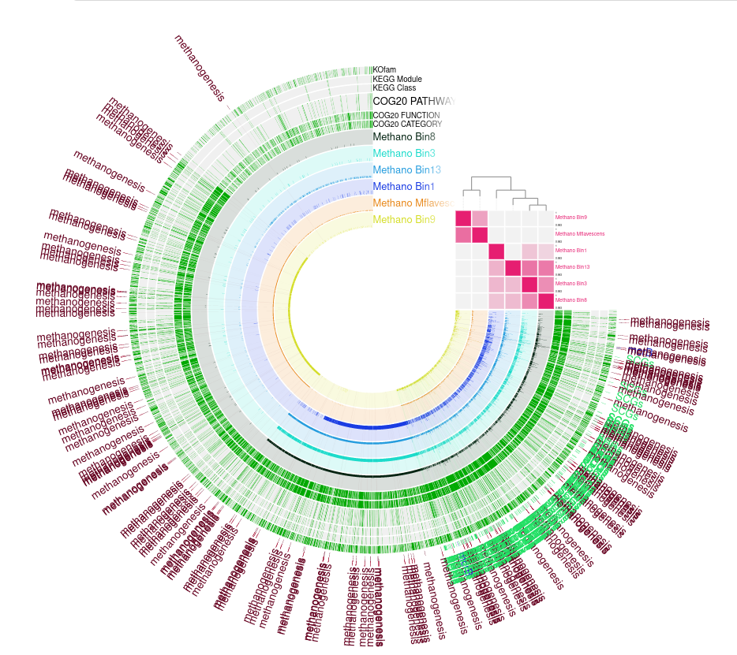

# Pangenomics and taxonomy

https://merenlab.org/2016/11/08/pangenomics-v2/


How do the MAGs compare in size and number of contigs to the full genome?




| Contigs Stats | Methano_Bin10 | Methano_Bin13 | Methano_Bin1 | Methano_Bin3 | Methano_Bin5 | Methano_Bin8 | Methano_Bin9 | Methano_Mflavescens |
| ---- | --- | ---- | ----- | ----- | ----- | ----- | ---- | --- |
| L50 |	93 | 27	| 89| 38	| 111	| 29 |	64 |	1 |

Genomes of Bin10, Bin9 and Bin8 are the "best" ones because they have relatively big genome sizes, smaller numer of contigs and longer average contig lenth. 


# Abundancy and completeness

The command provides its output as a table to the standard output of the terminal. What can you add to the code to direct output to, e.g. a .txt file?


How do the bins compare to isolate genomes? Would you remove one, based on the output of the completeness estimation?


###  Visualizing the pangenome

```
anvi-display-pan -p /work_beegfs/sunam225/data/Day6/03_pangenome/biol217/biol217-PAN.db -g /work_beegfs/sunam225/data/Day6/03_pangenome/METHANO-GENOMES.db -P 8090


```


# Interpreting pangenome

Based on the frequency clustering of genes, do you think all genomes are related? Why?

Bin9 and reference are related to each other and the rest bins have closer taxonomic relationships. Bin8 is the the most distinct. 




What observations can you make regarding the geometric homogeneity between all genomes and the functional homogeneity?




Can the organism do methanogenesis? Does it have genes similar to a bacterial secretion system?




check this sequence

MSNHKYAFFLGCIAPNRYPGIEASAIKTSEKVGIELLPLKGASCCPAPGAFGAIDLNIWYAMAARNVVLAEQMGVDITLICNGCYKSIYEVNEKLKHNDELRDGVNEVLKEIDMEFKGTIDVWHLAELYYDPKIVGLKKIADSVTRPLSGVKIAVHYGCHLMKPGKERHFGDTENPMWIEELVEALGAEPVQYRNKMLCCGAGGGVRGFDLVHSLDITNEKMINLQEVGADALTEVCPFCQLQYDRGQIEIEDKFGITWGLPVLHYNELLGLAQGMSPDELALDLHAVNVEPFLKKIL


https://consurf.tau.ac.il/fixed_params_and_waiting_page.php
